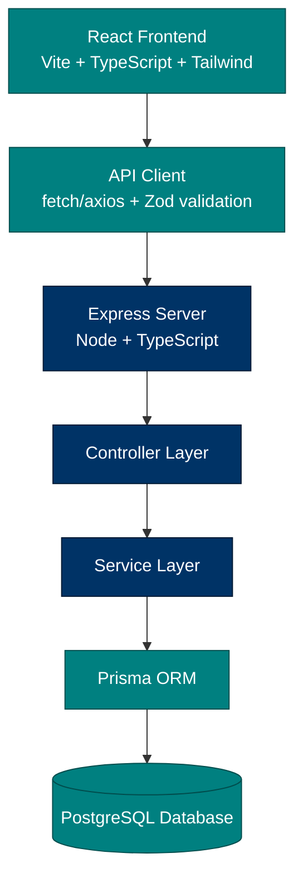

# Readr v2 — Full-Stack Reading Tracker

### _Turn pages into progress._

<p align="center">
  <a href="#"></a>
  <a href="#"></a>
  <a href="#"></a>
  <a href="#"></a>
  <br/>
  <a href="#"></a>
  <a href="#"></a>
  <a href="#"></a>
  <br/>
  <a href="https://github.com/conorgregson/readr-v2/actions/workflows/ci.yml">
    
  </a>
  <a href="https://github.com/conorgregson/readr-v2/actions/workflows/test.yml">
    
  </a>
</p>

---

## Overview

**Readr v2** is a full-stack rewrite of my original vanilla JavaScript reading tracker (v1.0–v1.9).
This version introduces:

- A modern **React + TypeScript** frontend
- A scalable **Express + PostgreSQL** backend
- **Prisma ORM** for typed database access
- **Docker** for local development
- Strong validation using **Zod**
- Modular, production-ready architecture

The original v1.x repo is here:
\*\*▶ https://github.com/conorgregson/reading-log-app

---

## Tech Stack

### Frontend

- React 18
- TypeScript
- Vite
- Tailwind CSS (v3)
- React Router
- Zustand or Context API
- Zod validation
- Vitest + React Testing Library

### Backend

- Node.js + TypeScript
- Express.js
- Prisma ORM
- Zod request validation
- PostgreSQL
- Docker + docker-compose
- Supertest (API testing)
- Helmet, CORS

---

## Project Structure

```bash
readr-v2/
│
├── client/                 # React frontend
│   ├── src/
│   │   ├── components/
│   │   ├── routes/
│   │   ├── store/
│   │   ├── services/
│   │   ├── lib/
│   │   └── App.tsx
│   ├── index.html
│   └── vite.config.ts
│
├── server/                 # Express backend
│   ├── src/
│   │   ├── api/
│   │   ├── services/
│   │   ├── schemas/
│   │   ├── db/
│   │   └── index.ts
│   ├── prisma/
│   │   └── schema.prisma
│   └── docker-compose.yml
│
└── README.md
```

---

## Architecture

### ASCII Diagram

```txt
                     ┌──────────────────────────┐
                     │        React UI          │
                     │  (Vite + TS + Tailwind)  │
                     └─────────────┬────────────┘
                                   │
                                   ▼
                      Client-side API Services

                                   │
                                   ▼
                   ┌─────────────────────────────────┐
                   │         Express API              │
                   │  Node.js + TypeScript + Zod      │
                   └───────────────┬─────────────────┘
                                   │
                                   ▼
                          Business Logic Layer
                       (services/, controllers/)

                                   │
                                   ▼
                        ┌───────────────────────┐
                        │     Prisma ORM        │
                        │  (Typed DB access)    │
                        └───────────┬──────────┘
                                    │
                                    ▼
                        ┌─────────────────────────┐
                        │     PostgreSQL DB       │
                        │  Dockerized Local Dev   │
                        └─────────────────────────┘
```

---

### Mermaid Diagram



---

## Screenshots

> Screenshots will be added during the v2.0 frontend development cycle.

- Dashboard _(coming soon)_
- Library / Book List _(coming soon)_
- Add Book Modal _(coming soon)_
- Session History _(coming soon)_
- Settings Panel _(coming soon)_

---

## Installation & Development

### 1. Clone the repo

```bash
git clone https://github.com/conorgregson/readr-v2.git
cd readr-v2
```

### 2. Frontend (client)

```bash
cd client
npm install
npm run dev
```

### 3. Backend (server)

```bash
cd server
npm install
npm run dev
```

### 4. Database (Docker + Postgres)

```bash
docker-compose up -d
```

---

## Roadmap

### v2.0 — React Frontend

- [ ] Book list UI
- [ ] Search & filter system
- [ ] Add book modal
- [ ] Reading session entry
- [ ] Import/export
- [ ] Streaks, summaries, and goals
- [ ] Snapshot generator rewrite
- [ ] Tailwind UI redesign

### v2.1 — Express API + PostgreSQL

- [ ] CRUD for books
- [ ] CRUD for reading sessions
- [ ] Import/export endpoint
- [ ] Pagination & filtering
- [ ] Zod validation layer
- [ ] Prisma migrations
- [ ] Dockerized dev environment
- [ ] Authentication (optional future)

### Future Versions

- [ ] Cloud deployment (AWS/Firebase)
- [ ] Mobile-first UI
- [ ] Deep gamification (badges, streaks, tiers)
- [ ] PDF/Notion export tools
- [ ] Premium features + commercialization

---

## Author

Made by **Conor Gregson**
Full-stack developer & designer of Readr.

- [GitHub](https://github.com/conorgregson)
- [LinkedIn](https://www.linkedin.com/in/conorgregson)

---

## License

This project is licensed under:

**Creative Commons Attribution–NonCommercial 4.0 International (CC BY-NC 4.0)**

You may view, use, and modify the source code for non-commercial purposes only.
Commercial use requires prior written permission.

Full license text:
https://creativecommons.org/licenses/by-nc/4.0/legalcode

See the [LICENSE](./LICENSE.md) file for details
