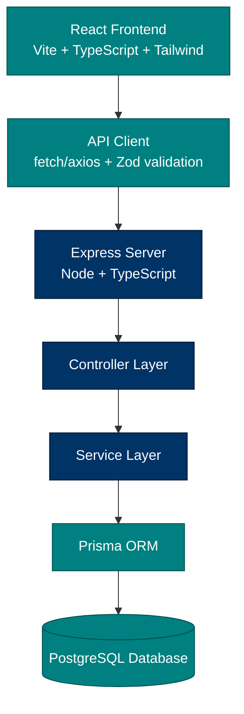

# Readr v2 — Full-Stack Reading Tracker

### _Turn pages into progress._

<p align="center">
  
  
  
  
  <br/>
  
  
</p>

---

## Overview

**Readr v2** is a deliberate full-stack rewrite of my original offline-first reading tracker (v1.0–v1.9).

The goal of v2 is not just a UI upgrade, but a structural evolution:

- A scalable Express + PostgreSQL backend
- A modern, strongly-typed React frontend
- Clear architectural boundaries between UI, state, and persistence
- Automated testing and CI from the foundation up

Each version isolates a specific risk area (architecture, UX, persistence, or scale) before layering new complexity.

The original v1.x app remains available here:
**▶** https://github.com/conorgregson/reading-log-app

> Current focus: v2.1 React frontend rebuild (feature parity phase).

---

## Table of Contents

- [Overview](#overview)
- [Why This Project](#why-this-project)
- [Roadmap](#roadmap-high-level)
- [Tech Stack](#tech-stack)
- [Project Structure](#project-structure)
- [Architecture](#architecture)
- [Engineering Decisions](#engineering-decisions)
- [Installation & Development](#installation--development)
- [Author](#author)
- [License](#license)

---

## Why This Project

Readr is both a product and a systems-design exercise.

It demonstrates:

- Incremental versioning discipline
- Frontend and backend separation of concerns
- Schema-driven validation (Zod + Prisma)
- CI-backed API testing
- Migration from offline-first architecture to API-backed persistence

The goal is not just to build features, but to evolve architecture intentionally.

---

## Roadmap Philosophy

Readr is developed in versioned milestones where each release isolates a specific risk area
(e.g., architecture, persistence, UX, or scale) before introducing new complexity.

The roadmap documents not just _what_ was built, but _why_ — serving as both a planning tool
and a technical narrative.

See the full roadmap in [`roadmap.md`](./roadmap.md).

---

## Changelog

All notable changes are documented in [`CHANGELOG.md`](./CHANGELOG.md),
following **Keep a Changelog** and **Semantic Versioning**.

---

## Release Strategy

Readr uses two parallel versioning systems:

### Official Releases (Semantic Versioning)

Major milestones follow **SemVer** and represent stable, coherent deliverables:

- `v2.0.0` — Backend & CI foundation
- `v2.1.0` — React frontend rebuild (in progress)
- Future versions increment semantically

These releases are published in GitHub Releases.

### Sprint Tags (Development Checkpoints)

During active development, sprint tags are used to mark internal milestones:

- `v2.1-sprint-0`
- `v2.1-sprint-1`
- …
- `v2.1-sprint-7`

Sprint tags serve as:

- Structured iteration checkpoints
- Rollback anchors
- Evidence of disciplined development cadence

Only SemVer releases represent official “ship-ready” states.

---

## Roadmap (High-Level)

- **v2.0.0** — Backend & CI foundation ✅
- **v2.1.0** — React frontend rebuild 🚧
- **v2.2.0** — API integration & persistence
- **v2.3+** — Accounts, analytics, and growth features

---

## Tech Stack

### Frontend

- React 18 (functional architecture)
- TypeScript (strict mode)
- Vite (ESM-first tooling)
- Tailwind CSS (utility-first styling system)
- React Router (route-level composition)
- Zustand (lightweight state isolation)
- Vitest + React Testing Library (component + logic testing)

### Backend

- Node.js + TypeScript
- Express (modular API architecture)
- Prisma ORM (typed database access layer)
- PostgreSQL (relational persistence)
- Zod (runtime validation aligned with schema design)
- Docker (isolated local database)
- GitHub Actions (automated CI validation)

---

## Project Structure

The repository is organized by architectural responsibility rather than framework convention, reinforcing separation between presentation, business logic, and persistence layers.

```bash
readr-v2/
│
├── client/                 # React frontend
│   ├── src/
│   │   ├── components/     # Reusable UI components
│   │   ├── routes/         # Route-level views
│   │   ├── store/          # Global state management
│   │   ├── services/       # API clients and adapters
│   │   ├── lib/            # Utilities and helpers
│   │   └── App.tsx
│   ├── index.html
│   └── vite.config.ts
│
├── server/                 # Express backend
│   ├── src/
│   │   ├── api/            # Route definitions
│   │   ├── services/       # Business logic
│   │   ├── schemas/        # Zod validation schemas
│   │   ├── db/             # Prisma client and DB helpers
│   │   └── index.ts        # Server entry point
│   ├── prisma/
│   │   └── schema.prisma
│   └── docker-compose.yml
│
├── CHANGELOG.md
├── roadmap.md
└── README.md
```

---

## Architecture

### ASCII Diagram

```txt
                     ┌──────────────────────────┐
                     │        React UI          │
                     │  (Vite + TS + Tailwind)  │
                     └─────────────┬────────────┘
                                   │
                                   ▼
                      Client-side API Services

                                   │
                                   ▼
                   ┌─────────────────────────────────┐
                   │         Express API              │
                   │  Node.js + TypeScript + Zod      │
                   └───────────────┬─────────────────┘
                                   │
                                   ▼
                          Business Logic Layer
                       (services/, controllers/)

                                   │
                                   ▼
                        ┌───────────────────────┐
                        │     Prisma ORM        │
                        │  (Typed DB access)    │
                        └───────────┬──────────┘
                                    │
                                    ▼
                        ┌─────────────────────────┐
                        │     PostgreSQL DB       │
                        │  Dockerized Local Dev   │
                        └─────────────────────────┘
```

---

### Mermaid Diagram


```mermaid
flowchart TD

A[React Frontend<br/>Vite + TypeScript + Tailwind]
  --> B[API Client<br/>fetch/axios + Zod validation]

B --> C[Express Server<br/>Node + TypeScript]

C --> D[Controller Layer]
D --> E[Service Layer]

E --> F[Prisma ORM]
F --> G[(PostgreSQL Database)]

classDef teal fill:#008080,stroke:#004d4d,color:white;
classDef navy fill:#003366,stroke:#001933,color:white;

class A,B teal
class C,D,E navy
class F,G teal
```

---

## Engineering Decisions

Readr v2 emphasizes architectural clarity and incremental evolution over rapid feature expansion.

Key decisions:

### 1. Backend-First Foundation (v2.0.0)

The backend was built and stabilized before rewriting the frontend to:

- De-risk persistence and schema design early
- Lock API boundaries before UI coupling
- Establish CI-backed integration testing from the start

### 2. Parity Before Expansion (v2.1)

The React frontend rebuild prioritizes feature parity with v1.9 before introducing API-backed persistence.
This avoids mixing behavioral changes with architectural migration.

### 3. Local-First → API Migration Strategy

v1.x was fully offline-first.
v2.1 rebuilds the UI locally.
v2.2 introduces API-backed persistence.

This staged migration reduces system-wide risk and simplifies debugging.

### 4. Strict Separation of Concerns

- UI components are isolated from state logic.
- Stores isolate state from persistence.
- Services abstract API interactions.
- Backend separates controllers, services, and schemas.

This keeps React → API integration friction low.

### 5. CI as a First-Class Concern

Backend endpoints are validated via automated API tests.
Health checks ensure deploy readiness.
Server lifecycle is explicitly handled to prevent resource leaks.

Engineering choices are documented to emphasize maintainability and long-term scalability.

---

## Screenshots

> Screenshots will be added during the v2.0 frontend development cycle.

- Dashboard _(coming soon)_
- Library / Book List _(coming soon)_
- Add Book Modal _(coming soon)_
- Session History _(coming soon)_
- Settings Panel _(coming soon)_

---

## Installation & Development

### 1. Clone the repo

```bash
git clone https://github.com/conorgregson/readr-v2.git
cd readr-v2
```

### 2. Frontend (client)

```bash
cd client
npm install
npm run dev
```

### 3. Backend (server)

```bash
cd server
npm install
npm run dev
```

### 4. Database (Docker + Postgres)

```bash
docker-compose up -d
```

---

## Roadmap (High-Level)

- **v2.0.0** — Backend & CI foundation ✅
- **v2.1.0** — React frontend rebuild (feature parity with v1.9) 🚧
- **v2.2.0** — API integration & persistence
- **v2.3.0** — Authentication & accounts
- **v2.4.0** — Server-side badges & gamification
- **v3.0.0** — Deployment & public release

For detailed version history and architectural milestones, see [`roadmap.md`](./roadmap.md).

---

## Author

<<<<<<< Updated upstream
Made by **Conor Gregson**

# Full-stack developer & designer of Readr.

Built and maintained by **Conor Gregson**.

> > > > > > > Stashed changes

Readr is a long-term, versioned project designed to demonstrate:

- Full-stack architectural design
- Progressive migration from offline-first to API-backed systems
- CI-driven backend development
- React + TypeScript frontend engineering
- Incremental versioning and release discipline

- **GitHub**: https://github.com/conorgregson
- **LinkedIn**: https://www.linkedin.com/in/conorgregson

---

## License

This project is licensed under:

**Creative Commons Attribution–NonCommercial 4.0 International (CC BY-NC 4.0)**

You may view, use, and modify the source code for non-commercial purposes only.
Commercial use requires prior written permission.

Full license text:
https://creativecommons.org/licenses/by-nc/4.0/legalcode

See the [LICENSE](./LICENSE.md) file for details
