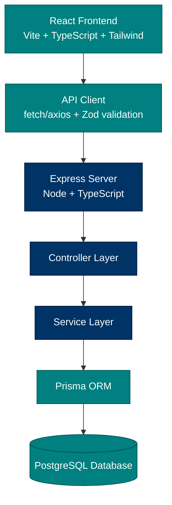

# Readr v2 — Full-Stack Reading Tracker

### _Turn pages into progress._

<p align="center">
  
  
  
  
  <br/>
  
  
</p>

---

## Overview

**Readr v2** is a full-stack rewrite of my original offline-first reading tracker (v1.0–v1.9).

v2 focuses on:
- A scalable backend foundation
- A modern React frontend
- Strong validation, testing, and CI
- Clear architectural boundaries

The original v1.x app remains available here:
**▶** https://github.com/conorgregson/reading-log-app

---

## Roadmap Philosophy

Readr is developed in versioned milestones where each release isolates a specific risk area
(e.g., architecture, persistence, UX, or scale) before introducing new complexity.

The roadmap documents not just *what* was built, but *why* — serving as both a planning tool
and a technical narrative.

See the full roadmap in [`roadmap.md`](./roadmap.md).

---

## Changelog

All notable changes are documented in [`CHANGELOG.md`](./CHANGELOG.md),
following **Keep a Changelog** and **Semantic Versioning**.

---

## Roadmap (High-Level)

- **v2.0.0** — Backend & CI foundation ✅
- **v2.1.0** — React frontend rebuild 🚧
- **v2.2.0** — API integration & persistence
- **v2.3+** — Accounts, analytics, and growth features

---

## Tech Stack

### Frontend
- React 18
- TypeScript
- Vite
- Tailwind CSS
- React Router
- Zustand / Context
- Vitest + React Testing Library

### Backend
- Node.js + TypeScript
- Express
- Prisma ORM
- PostgreSQL
- Zod validation
- Docker
- GitHub Actions CI

---

## Project Structure

The repository is organized by responsibility, not framework.

```bash
readr-v2/
│
├── client/                 # React frontend
│   ├── src/
│   │   ├── components/     # Reusable UI components
│   │   ├── routes/         # Route-level views
│   │   ├── store/          # Global state management
│   │   ├── services/       # API clients and adapters
│   │   ├── lib/            # Utilities and helpers
│   │   └── App.tsx
│   ├── index.html
│   └── vite.config.ts
│
├── server/                 # Express backend
│   ├── src/
│   │   ├── api/            # Route definitions
│   │   ├── services/       # Business logic
│   │   ├── schemas/        # Zod validation schemas
│   │   ├── db/             # Prisma client and DB helpers
│   │   └── index.ts        # Server entry point
│   ├── prisma/
│   │   └── schema.prisma
│   └── docker-compose.yml
│
├── CHANGELOG.md
├── roadmap.md
└── README.md
```
---

## Architecture

### ASCII Diagram

```txt
                     ┌──────────────────────────┐
                     │        React UI          │
                     │  (Vite + TS + Tailwind)  │
                     └─────────────┬────────────┘
                                   │
                                   ▼
                      Client-side API Services

                                   │
                                   ▼
                   ┌─────────────────────────────────┐
                   │         Express API              │
                   │  Node.js + TypeScript + Zod      │
                   └───────────────┬─────────────────┘
                                   │
                                   ▼
                          Business Logic Layer
                       (services/, controllers/)

                                   │
                                   ▼
                        ┌───────────────────────┐
                        │     Prisma ORM        │
                        │  (Typed DB access)    │
                        └───────────┬──────────┘
                                    │
                                    ▼
                        ┌─────────────────────────┐
                        │     PostgreSQL DB       │
                        │  Dockerized Local Dev   │
                        └─────────────────────────┘
```

---

### Mermaid Diagram


```mermaid
flowchart TD

A[React Frontend<br/>Vite + TypeScript + Tailwind]
  --> B[API Client<br/>fetch/axios + Zod validation]

B --> C[Express Server<br/>Node + TypeScript]

C --> D[Controller Layer]
D --> E[Service Layer]

E --> F[Prisma ORM]
F --> G[(PostgreSQL Database)]

classDef teal fill:#008080,stroke:#004d4d,color:white;
classDef navy fill:#003366,stroke:#001933,color:white;

class A,B teal
class C,D,E navy
class F,G teal
```

---

## Screenshots

> Screenshots will be added during the v2.0 frontend development cycle.

- Dashboard _(coming soon)_
- Library / Book List _(coming soon)_
- Add Book Modal _(coming soon)_
- Session History _(coming soon)_
- Settings Panel _(coming soon)_

---

## Installation & Development

### 1. Clone the repo

```bash
git clone https://github.com/conorgregson/readr-v2.git
cd readr-v2
```

### 2. Frontend (client)

```bash
cd client
npm install
npm run dev
```

### 3. Backend (server)

```bash
cd server
npm install
npm run dev
```

### 4. Database (Docker + Postgres)

```bash
docker-compose up -d
```

---

## Roadmap

### v2.0 — React Frontend (In Progress)

- [ ] Book list UI
- [ ] Search & filter system
- [ ] Add book modal
- [ ] Reading session entry
- [ ] Import/export
- [ ] Streaks, summaries, and goals
- [ ] Snapshot generator rewrite
- [ ] Tailwind UI redesign

### v2.1 — Express API + PostgreSQL

- [ ] CRUD for books
- [ ] CRUD for reading sessions
- [ ] Import/export endpoint
- [ ] Pagination & filtering
- [ ] Zod validation layer
- [ ] Prisma migrations
- [ ] Dockerized dev environment
- [ ] Authentication (optional future)

### Future Versions

- [ ] Cloud deployment (AWS/Firebase)
- [ ] Mobile-first UI
- [ ] Deep gamification (badges, streaks, tiers)
- [ ] PDF/Notion export tools
- [ ] Premium features + commercialization

---

## Author

Made by **Conor Gregson** • Full-stack developer & designer of Readr.

- [GitHub](https://github.com/conorgregson)
- [LinkedIn](https://www.linkedin.com/in/conorgregson)

---

## License

This project is licensed under:

**Creative Commons Attribution–NonCommercial 4.0 International (CC BY-NC 4.0)**

You may view, use, and modify the source code for non-commercial purposes only.
Commercial use requires prior written permission.

Full license text:
https://creativecommons.org/licenses/by-nc/4.0/legalcode

See the [LICENSE](./LICENSE.md) file for details
